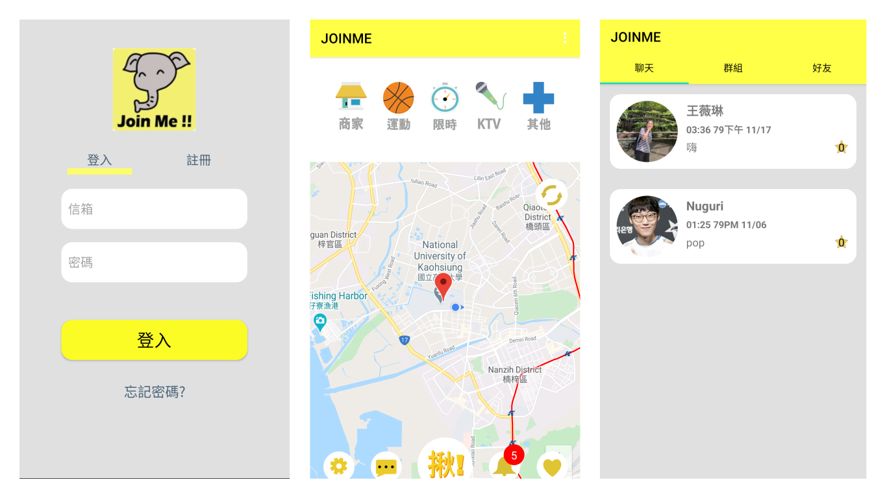

# 
 JOINME

這是一個提倡即時性揪團的APP，以地圖更直覺地顯示活動的資訊，更方便、更迅速的建立與參加活動，利用O2O(Online to Offline)的商業模式，以線上的揪團平台帶動線下的活動，並且有良好的活動群組、個人聊天機制，也透過活動與個人的評價保障參加活動的的品質與安全。
   
     
  

***

### Introducing JOINME

此APP具有許多功能，線下活動可透過APP在線上整合，並在線上藉由與商家合作等方式，創造更多價值，在進行活動時，使用者可透過此APP進行定位報名等特別功能，而在活動結束後，使用者也可給予該活動主辦人或參加者評分。此外，透過APP回饋的部分，我們會再將使用者意見與類似系統進行評估與分析，並對此APP進行修正或擴增功能，藉此與其他系統做出市場區隔、提升商業優勢。以下為預計的主要功能架構

## List of Contents

1. [Features](#features)
2. [Backend Server](#backendserver)
3. [Demo](#demo)

<h2 id="features">Features</h2>

我們以google map及google place API為主，以地圖的形式讓使用者對活動所在地更加視覺化，並利用定位功能偵測使用者所在位置，協助其完成報到，避免參與者實際上未到活動地點卻報到的情況。另外，此APP也包含群組聊天室、評價等功能，來輔助活動的進行及後續發展，期望能提供使用者完善的活動機制，讓使用者在舉辦及參與活動上有更方便的管道。

<h2 id="backendserver">Backend Server</h2>

我們使用firebase作為我們的backend server，用此存放資料、管理使用者、推撥活動通知。

<h2 id="demo">Demo</h2>

